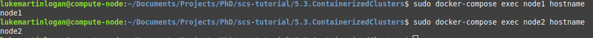
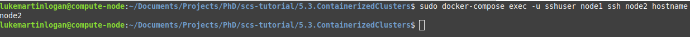

This is a brief guide on how to use Docker.

# 5.1. Installation

For ubuntu:
```
sudo apt install docker
```

For RHEL
```
sudo yum install docker
```

# 5.2. Docker Basics

In this section, we go through an example of a Dockerfile and how to create a
container.

## 5.2.1. Setup

First, cd into the 5.2.DockerBasics directory of the scs-tutorial.
```bash
cd scs-tutorial/5.2.DockerBasics
```

This directory contains a single file: Dockerfile

## 5.2.2. Create a Dockerfile
Below is an example [Dockerfile](https://github.com/scs-lab/scs-tutorial/blob/main/5.2.DockerBasics/Dockerfile) which creates a basic Ubuntu20.04 container.
```docker
# Install ubuntu 20.04
FROM ubuntu:20.04
LABEL maintainer="llogan@hawk.iit.edu"
LABEL version="0.0"
LABEL description="An example docker image"

# Disable Prompt During Packages Installation
ARG DEBIAN_FRONTEND=noninteractive

# Update ubuntu
RUN apt update && apt install

# Install some basic packages
RUN apt install -y \
    openssh-server \
    sudo

# Set an environment variable
ENV MY_VAR=hi

# Print environment variable
RUN echo ${MY_VAR}
```

1. FROM ubuntu:20.04 indicates the OS version that docker should install.
There are other OSes, such as fedora:latest, ubuntu:latest, centos:centos8.
This can be useful for testing portability.
2. LABEL parameters are just metadata
3. RUN executes a command as if in a terminal
4. ENV sets an environment variable

## 5.2.3. Build the container image

First, the container image must be built. This will parse the Dockerfile, install the OS, and run all commands in the Dockerfile.
The syntax is as follows:
```bash
sudo docker build -t [IMAGE_NAME] [DOCKERFILE_DIR, can be a github link] -f [DOCKERFILE_NAME]
```
1. IMAGE_NAME: a semantic name for the image being built. NOTE: the name must be in snake case (i.e., no caps).
2. DOCKERFILE_DIR: the directory containing the Dockerfile.
3. DOCKERFILE_NAME: the name of the dockerfile in that directory. This is optional. Default: Dockerfile.

Let's say that our Dockerfile is located at ${HOME}/MyDockerfiles/Dockerfile.
We could build the image two ways:
```
# Option 1: a single command
sudo docker build -t myimage ${HOME}/MyDockerfiles

# Option 2: cd into the directory
cd ${HOME}/MyDockerfiles
sudo docker build -t myimage .
```

## 5.2.4. Run the container

Next, we must run the container. This will create a container from the container image. There can be multiple containers made from the same image.
The syntax is as follows:
```bash
sudo docker run [OPTIONS] [IMAGE_NAME] [COMMAND (optional)]
```
1. OPTIONS: There are many settings which docker provides. We'll go over some of them below.
2. IMAGE_NAME: The semantic name of the image to build the container from
3. COMMAND: An optional command to run within the container.

This command will create a container CONTAINER_ID from IMAGE_NAME which uses the host network to connect to the internet and download packages.

In our case, we want to make the container interactive (i.e., have a shell):
```
sudo docker run -it --name mycontainer --network host myimage
```
We use the option "-it" to specify this is an interactive session.

## 5.2.5. Interacting with the container

You can reconnect to an interactive container's shell using docker exec. The syntax is as follows:
```bash
sudo docker exec [CONTAINER_ID] /bin/bash
```

You can now run commands within the image. For us, this would be:
```bash
sudo docker exec mycontainer /bin/bash
```

## 5.2.6. Useful Commands
```bash
# Run a container with a shared directory between guest and host
sudo docker run -it --name [CONTAINER_ID] --mount src=[HOST_PATH],target=[CONTAINER_PATH],type=bind --network host [IMAGE_NAME]

# List all running containers
sudo docker container ls

# List all container IDs
sudo docker container ls --all

# Get interactive shell for container
sudo docker exec [CONTAINER_ID] /bin/bash

# Execute command in container
docker exec [CONTAINER_ID] [COMMAND]

# Kill a running container
sudo docker stop [CONTAINER_ID]

# Delete a container
sudo docker rm [CONTAINER_ID]

# Commit the state of a container CONTAINER_ID into a new container
# COPY_CONTAINER_ID
sudo docker commit [CONTAINER_ID] [COPY_CONTAINER_ID]
```

# 5.3. Containerized Clusters

It can be useful to create clusters of Docker images for purposes of continuous
integration. In this section, we provide an example of spawning a cluster of two
nodes and executing commands in them.

## 5.3.1. Setup

First, cd into the correct tutorial directory
```bash
cd scs-tutorial/5.3.ContainerizedClusters
```

This directory contains two files:
1. Dockerfile
2. docker-compose.yml

### 5.3.2. Create SSH keys

Next we need to create SSH keys. We will place the SSH keys
in the current working directory, **NOT** in ~/.ssh. Data cannot
be copied to a Docker container at build time unless that data
is a subdirectory of the current working directory.

```bash
ssh-keygen -t rsa -f ${PWD}/id_rsa -N "" -q
```
**-t rsa** uses RSA for the algorithm.
**-f ${PWD}/id_rsa** defines the output for the private key to be in this directory.
**-N ""** indicates no password should be generated.
**-q** disables interactive prompts.

## 5.3.3. OpenSSH-Server Dockerfile

We have a sample [Dockerfile](https://github.com/scs-lab/scs-tutorial/blob/main/5.3.ContainerizedClusters/Dockerfile) which provides passwordless openssh
daemon in ubuntu 20.04. We describe the sections of the Dockerfile below.

### 5.3.3.1. Install OpenSSH

First, we install openssh, sudo, some text editors, and git.
Technically, git and the text editors aren't required, but they
almost always come in useful in real projects.

```dockerfile
# Install ubuntu 20.04
FROM ubuntu:20.04
LABEL maintainer="llogan@hawk.iit.edu"
LABEL version="0.0"
LABEL description="An example docker image"

# Disable Prompt During Packages Installation
ARG DEBIAN_FRONTEND=noninteractive

# Update ubuntu
RUN apt update && apt install

# Install some basic packages
RUN apt install -y \
    openssh-server \
    sudo git nano vim
```

### 5.3.3.2. Create a user

Next, we create a new user called "sshuser". Many tools complain about
using root mode for everything. While technically safe to do in a container,
we make a custom user anyway.

```dockerfile
# Create a new user
# -m makes the home directory
RUN useradd -m sshuser

# Make the user an admin
RUN usermod -aG sudo sshuser

# Disable password for this user
RUN passwd -d sshuser
```

### 5.3.3.3. Copy SSH keys

We now copy the SSH keys from the host machine to the client machine and give
them the proper permissions. The SSH keys we created in section 5.3.2 should be
located in the same directory as this Dockerfile.

```dockerfile
# Copy the host's SSH keys
# Docker requires COPY be relative to the current working
# directory. We cannot pass ~/.ssh/id_rsa unfortunately...
RUN sudo -u sshuser mkdir ${SSHDIR}
COPY id_rsa ${SSHDIR}/id_rsa
COPY id_rsa.pub ${SSHDIR}/id_rsa.pub

# Authorize host SSH keys
RUN sudo -u sshuser touch ${SSHDIR}/authorized_keys
RUN cat ${SSHDIR}/id_rsa.pub >> ${SSHDIR}/authorized_keys

# Set SSH permissions
RUN chmod 700 ${SSHDIR}
RUN chmod 644 ${SSHDIR}/id_rsa.pub
RUN chmod 600 ${SSHDIR}/id_rsa
RUN chmod 600 ${SSHDIR}/authorized_keys
```

### 5.3.3.4. Start SSH server

Lastly, we configure the openssh server to allow for empty passwords and
then start it.
```dockerfile
# Enable passwordless SSH
# Replaces #PermitEmptyPasswords no with PermitEmptyPasswords yes
RUN sed -i 's/#PermitEmptyPasswords no/PermitEmptyPasswords yes/' /etc/ssh/sshd_config

# Create this directory, because sshd doesn't automatically
RUN mkdir /run/sshd

# Start SSHD
CMD ["/usr/sbin/sshd", "-D"]
```

## 5.3.4. Docker Compose File

Docker compose is used to spawn multiple docker containers. This has
a separate configuration.

Below is our example [docker-compose.yaml](https://github.com/scs-lab/scs-tutorial/blob/main/5.3.ContainerizedClusters/docker-compose.yaml)
```yaml
version: "3"

services:
  node1:
    build: .
    links:
      - node2
    networks:
      - net
    hostname: node1
    stdin_open: true
    tty: true

  node2:
    build: .
    networks:
      - net
    hostname: node2
    stdin_open: true
    tty: true

networks:
  net:
    driver: bridge
```

Here we create two nodes: node1 and node2. The "services" section represents the
set of nodes that will be spawned.
1. node1 and node2 are the names of the containers that will be spawned.
2. build: where docker-compose will search for the Dockerfile. In our case,
its the local directory. We used the default names for the Dockerfile and
docker-compose.yaml.
3. networks: label the network the containers are apart of.
"net" is not special; it is just a name, it can be anything.
4. hostname: the name of the host on the network. We force the containers
hostname to be equivalent to the name of the container.
5. links: enable communication between two nodes. Note, node2 doesn't specify
a link to node1. This is because links are already two-way, so it will
result in a cyclic dependency error.

## 5.3.5. Build the cluster

First we have to build the container images for the cluster. This will
parse docker-compose.yaml (which is the default name used by docker-compose)
```bash
sudo HOST_USER=${USER} docker-compose build
```

## 5.3.6. Spawn the cluster

To spawn the cluster, run the following command
```bash
sudo HOST_USER=${USER} docker-compose up
```

## 5.3.7. Execute commands

First, we will verify node1 and node2 can be accessed:
```bash
sudo docker-compose exec -u sshuser node1 hostname
sudo docker-compose exec -u sshuser node2 hostname
```

These commands should print "node1" and "node2".


Next, we will try performing ssh from one node into the other.
```bash
sudo docker-compose exec -u sshuser node1 ssh node2 hostname
```

The above command will execute "ssh node2 hostname" in node1. Its
result should be:


## 5.3.8. Interactive shell with cluster nodes

To get an interactive shell of a node in the cluster, do the following
```bash
sudo docker-compose exec -u sshuser node1 /bin/bash
```

## 5.3.9. Shutdown the cluster
```bash
sudo docker-compose down
```
